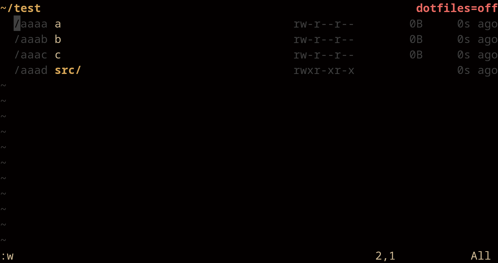

# bex.vim

A simple ID-tracked file browser for Vim. The name **bex** stands for **Better Explorer**.

`bex.vim` loads a directory listing into a standard text buffer where each line is prefixed with a visible tracking ID (`/xxxx `). You can modify, delete, or create lines using native Vim commands. Saving the buffer with `:w` commits those changes to disk.



## Features

* Support for rendering images with chafa. (Works well with true color)

## Usage

* Open explorer

```
:Bex [OPTION]... [PATH]
```

* Options

```
-r
    reload buffers
```

## Configuration
Moving Bex header to top/bottom can be set with:
```vim
let g:bex_header_at_bottom = 1
```

To change theme for 24-bit true color you can set these global variables if termguicolors is set, else it defaults to whatever ANSI colors are already set, if notermguicolors is set, it uses cterm colors, and 8 color mode with bold is used if &t_Co < 16.
```vim
let g:bex_gui_black      = '#000000'
let g:bex_gui_red        = '#AA0000'
let g:bex_gui_green      = '#00AA00'
let g:bex_gui_yellow     = '#AA5500'
let g:bex_gui_blue       = '#0000AA'
let g:bex_gui_magenta    = '#AA00AA'
let g:bex_gui_cyan       = '#00AAAA'
let g:bex_gui_white      = '#AAAAAA'

let g:bex_gui_br_black   = '#555555'
let g:bex_gui_br_red     = '#FF5555'
let g:bex_gui_br_green   = '#55FF55'
let g:bex_gui_br_yellow  = '#FFFF55'
let g:bex_gui_br_blue    = '#5555FF'
let g:bex_gui_br_magenta = '#FF55FF'
let g:bex_gui_br_cyan    = '#55FFFF'
let g:bex_gui_br_white   = '#FFFFFF'
```
To change highlight groups you simply apply a valid token, you can find token list here [Color Tokens](#color-tokens)
```vim
let g:bex_hi_BexHeader          = 'br_yellow'
let g:bex_hi_BexInfo            = 'br_black'
let g:bex_hi_BexDir             = 'br_yellow'
let g:bex_hi_BexFile            = 'br_white'
let g:bex_hi_BexHiddenDir       = 'yellow'
let g:bex_hi_BexHiddenFile      = 'white'
let g:bex_hi_BexVisible         = 'br_green'
let g:bex_hi_BexHidden          = 'br_red'
let g:bex_hi_BexID              = 'br_black'
let g:bex_hi_BexHiddenID        = 'br_black'
let g:bex_hi_BexExec            = 'br_green'
let g:bex_hi_BexSymlink         = 'br_blue'

let g:bex_hi_BexChangesDir      = 'br_yellow'
let g:bex_hi_BexChangesDel      = 'br_red'
let g:bex_hi_BexChangesAdd      = 'br_green'
let g:bex_hi_BexChangesRename   = 'br_cyan'
let g:bex_hi_BexChangesMoveFrom = 'br_black'
let g:bex_hi_BexChangesMoveTo   = 'br_magenta'
let g:bex_hi_BexChangesCopy     = 'br_blue'
let g:bex_hi_BexDotfilesOn      = 'br_green'
let g:bex_hi_BexDotfilesOff     = 'br_red'
let g:bex_hi_BexModified        = 'br_blue'
```
## Color Tokens
```
0   black
1   red
2   green
3   yellow
4   blue
5   magenta
6   cyan
7   white
8   br_black
9   br_red
10  br_green
11  br_yellow
12  br_blue
13  br_magenta
14  br_cyan
15  br_white
```

## Binds

```
RETURN
    Navigate into file/directory.

-
    Navigate to sub directory.

TAB
    Toggle between viewing file system modifications and current directory.
    Inside interface RETURN can be pressed to revert modifications and E can be used to extract to current directory.

.
    Toggle visibility of dotfiles.

g+d
    Goto definition with symlinks.
```

## Installation

### Via [vim-plug](https://github.com/junegunn/vim-plug)

```vim
Plug 'stqqrm/bex.vim'
```

## Todo

* Add support for unpacking/packing .zip, .rar, .7z and .tar.
